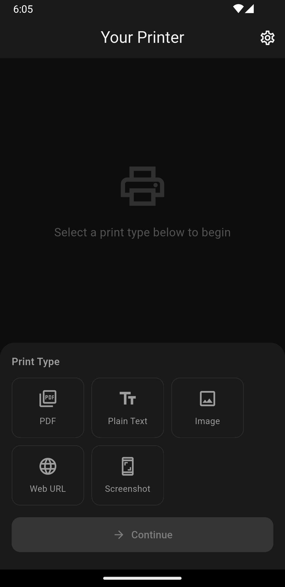
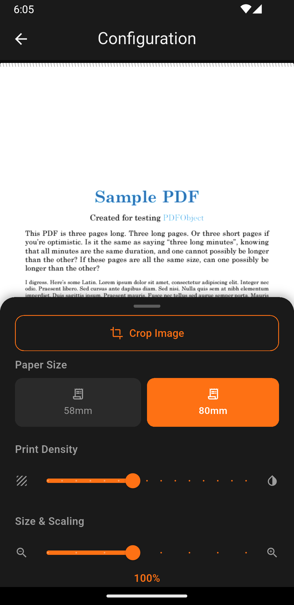
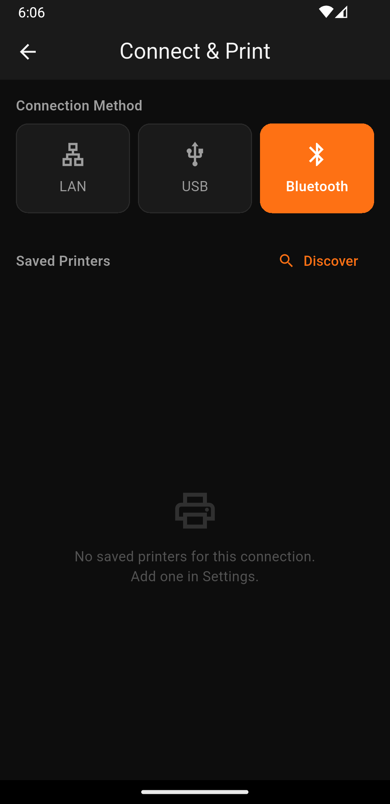
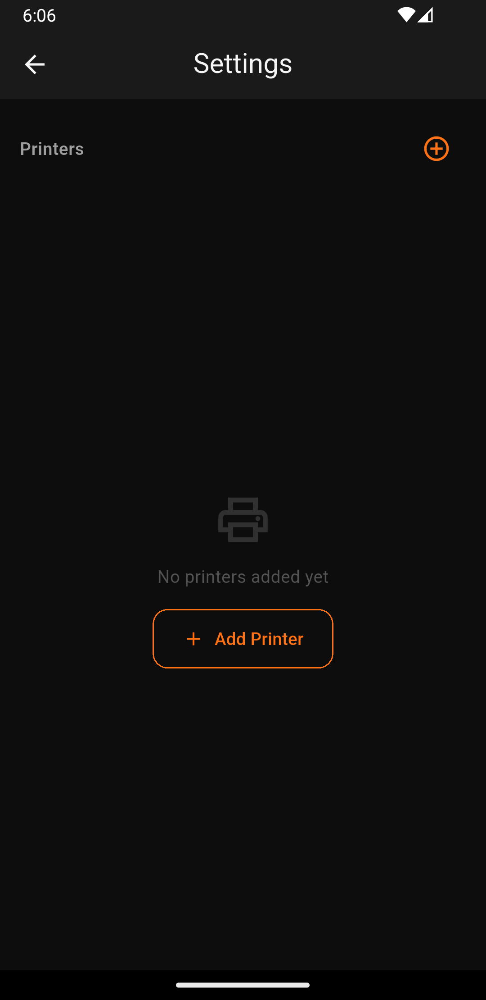

# Your Printer

A thermal printer companion app for Android. Print text, images, and PDFs via Bluetooth or USB.

## Features

- Print plain text, images, and PDFs
- Connect via Bluetooth (BLE) or USB
- Real-time print preview
- Image cropping before printing
- Dark theme UI

## Screenshots

| Home | Configure | Connect | Settings |
|---|---|---|---|
|  |  |  |  |

## Getting Started

### Prerequisites

- Flutter SDK ^3.11.5
- Android device or emulator (API 21+)
- Bluetooth/USB thermal printer (e.g., Epson, Star, generic ESC/POS)

### Install

```bash
git clone <repo-url>
cd your_printer
flutter pub get
flutter run
```

### Build for Release

```bash
# Android App Bundle (Play Store)
flutter build appbundle

# APK (direct install)
flutter build apk --release
flutter install
```

## Tech Stack

| Package | Purpose |
|---|---|
| `flutter_blue_plus` | Bluetooth/BLE printer connection |
| `usb_serial` | USB printer connection |
| `esc_pos_utils` | ESC/POS command generation |
| `provider` | State management |
| `file_picker` | File selection (images, PDFs) |
| `image_cropper` | Image cropping |
| `pdfx` | PDF preview rendering |

## License

MIT
